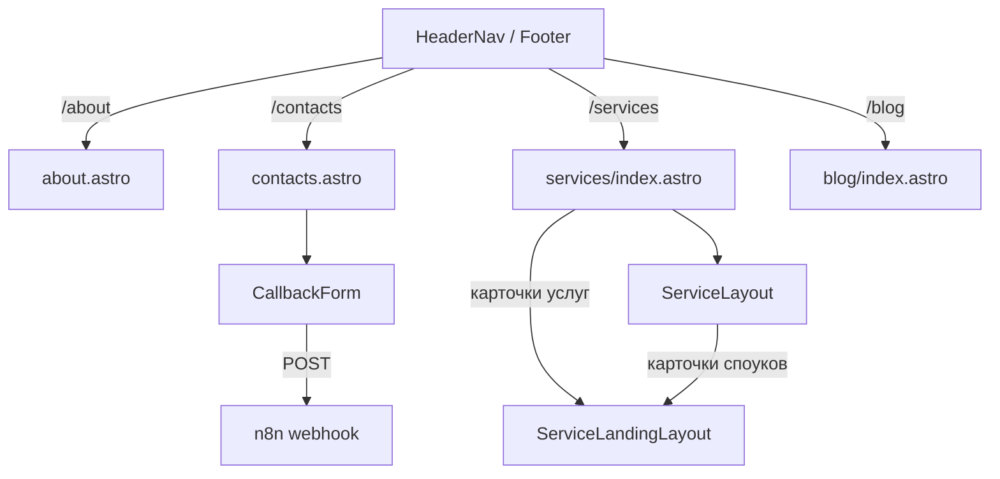

# Requirements

### Overview & Goals
Привести сайт «За рулём» (техпомощь в Тюмени) к исходному шаблону `source/` и убрать якорные (`#`) ссылки, заменив их полноценными страницами и маршрутами. Все страницы верстаются переносом HTML из референсов, меняются только тексты на русские (от первого лица мастера).

### Scope
**В объёме:**
- Заменить якоря `/#about`, `/#contact` в навигации, подвале и CTA-кнопках на маршруты `/about`, `/contacts`.
- Новая страница `/about` по `source/about.html`.
- Новая страница `/contacts` по `source/contact.html` с рабочей формой заявки (n8n).
- Перестроить каталог `/services` по `source/services.html` (сетка карточек отдельных услуг).
- Перестроить хаб услуги `/services/<cluster>` в детальную структуру по `about.html` + карточки услуг из `services.html`.
- Перестроить детальную услугу `/services/<cluster>/<spoke>` по `source/service-single.html` (устранить 404/несоответствие).
- Перестроить список блога `/blog` по `source/blog.html`.
- Обновить `urls-seo.txt` и `SUMMARY.md`.

**Вне объёма:** переписывание SEO-текстов статей/споков, новые кластеры/споуки, изменение глобальных стилей шаблона.

### User Stories
- Как посетитель, открываю «О сервисе» и «Контакты» по прямым ссылкам, а не якорем на главной.
- Как посетитель, вижу на `/services` сетку карточек услуг и перехожу в детальную страницу без 404.
- Как посетитель, вижу страницы услуг/блога/о сервисе/контактов в дизайне шаблона.
- Как владелец, получаю заявку со страницы контактов в N8N.

### Functional Requirements
1. Пункты меню и все CTA («Вызвать помощь»/«Оставить заявку») ведут на `/about` и `/contacts`.
2. `/services` — сетка карточек отдельных услуг (разметка `services.html`), карточка ведёт на детальную страницу.
3. Детальная страница услуги открывается по URL и свёрстана по `service-single.html` (шапка+хлебные крошки, сайдбар со списком услуг и CTA, контент с картинкой и FAQ).
4. `/blog` свёрстан по `blog.html`.
5. `/about` по `about.html`, `/contacts` по `contact.html`.
6. Форма на `/contacts` шлёт заявку на `https://n8n.w1do.ru/webhook/requests` с `project: "za-rulem"` через существующий хук.

### Non-Functional Requirements
- Тексты только русские, от первого лица («я/меня/мой»).
- Пути к ассетам абсолютные (`/images/...`).
- Сохранить SSG-сборку Astro; `npm run build` без ошибок, число страниц не уменьшается.

# Technical Design

### Current Implementation
- Astro SSG (`astro.config.mjs`), React для форм.
- `HeaderNav.astro`: «О сервисе»→`/#about`, «Контакты»→`/#contact`, кнопка→`/#contact`. `Footer.astro`: те же якоря в quickLinks/кнопке/privacy.
- `src/pages/services/index.astro`: рендерит только хабы (`services`) → одна карточка; разметка `our-service`, не совпадает с `services.html`.
- Кластер: `content.config.ts` — коллекции `services` (pillar) и `serviceLanding` (spokes). Роуты `services/[cluster]/index.astro` (хаб→`ServiceLayout`) и `[cluster]/[post].astro` (спок→`ServiceLandingLayout`). Контент в `src/content/services/tehpomosch/` (index + 4 спока).
- `ServiceLandingLayout.astro`: кастомная шапка `page-header dark-section`, а не `page-header parallaxie`+breadcrumb как в `service-single.html`; CTA на `/#contact`.
- `blog/index.astro`: разметка `our-blog`, не совпадает с `blog.html`.
- Форма: `CallbackForm.tsx` + `useCallbackForm.ts` (готовый хук отправки в n8n), используется на главной и в лендингах.

### Key Decisions
- **`/services` — карточки отдельных услуг (споуков)**, чтобы сетка была заполнена как в `services.html` (решает «карточки не выводятся / одна карточка»). Подтверждено пользователем.
- **Хаб услуги — детальная структура по `about.html`** + секция карточек услуг (`services.html`) для споуков кластера. Подтверждено.
- **Детальная услуга — по `service-single.html`**: `ServiceLandingLayout` переписывается (шапка parallaxie+крошки, сайдбар `page-category-list`+`sidebar-cta`, контент с картинкой и FAQ). Подтверждено.
- **About/Contacts — перенос секций референсов** 1:1, тексты русские; форма контактов через существующий `CallbackForm`. Подтверждено.
- **Компонентный подход**: повторяющиеся блоки (шапка страницы, карточка услуги, карточка поста) выносятся в переиспользуемые `.astro`-компоненты.

### Proposed Changes
1. `HeaderNav.astro`, `Footer.astro`: `/#about`→`/about`, `/#contact`→`/contacts` (меню, кнопки, privacy). CTA `/#contact`→`/contacts` в `ServiceLayout`/`ServiceLandingLayout`.
2. `src/pages/contacts.astro` (new) по `contact.html`: `page-header`+`page-contact-us` (контактный блок + форма через `CallbackForm`, subject «Заявка со страницы контактов», телефон `+7 908 871-20-26`).
3. `src/pages/about.astro` (new) по `about.html`: перенос секций (About/Our Approach/Why Choose/What We Do), русские тексты; где уместно — на базе Home-компонентов.
4. `src/pages/services/index.astro` (rewrite) по `services.html`: `page-header parallaxie`+breadcrumb+сетка `service-item`; источник карточек — `serviceLanding`, ссылка на `/services/<cluster>/<spoke>`; карточка вынесена в компонент.
5. `ServiceLayout.astro` (update): детальная структура по `about.html` + секция карточек споуков.
6. `ServiceLandingLayout.astro` (rewrite) по `service-single.html`.
7. `blog/index.astro` (rewrite) по `blog.html` (`page-blog`+`post-item`), карточка поста в компонент.
8. Обновить `urls-seo.txt` (+`/about`, `/contacts`) и `SUMMARY.md`.

### Data Models / Contracts
Схемы `content.config.ts` не меняются. Контракт формы (существующий хук):
```json
POST https://n8n.w1do.ru/webhook/requests
{ "email":"", "subject":"", "phone":"", "message":"", "project":"za-rulem" }
```

### Components
- Новые: `PageHeader.astro`, `services/ServiceCard.astro`, `blog/PostCard.astro`.
- Изменяемые: `HeaderNav.astro`, `Footer.astro`, `ServiceLayout.astro`, `ServiceLandingLayout.astro`, `services/index.astro`, `blog/index.astro`.
- Как есть: `CallbackForm.tsx`, `useCallbackForm.ts`, `Layout.astro`, `Header.astro`, `Footer.astro`.

### File Structure
```
src/pages/about.astro            (new)
src/pages/contacts.astro         (new)
src/pages/services/index.astro   (rewrite)
src/pages/blog/index.astro       (rewrite)
src/layouts/ServiceLayout.astro         (update)
src/layouts/ServiceLandingLayout.astro  (rewrite)
src/components/shared/header/HeaderNav.astro (update)
src/components/shared/footer/Footer.astro    (update)
src/components/services/ServiceCard.astro    (new)
src/components/blog/PostCard.astro           (new)
urls-seo.txt, SUMMARY.md         (update)
```

### Architecture Diagram


### Risks
- Секции `id=contact`/`about` на главной остаются, но навигация на них больше не ссылается — проверить, что главная не сломана.
- При переносе HTML заменить `images/...`→`/images/...` и `#`-ссылки на реальные.
- Не нарушить фильтры `data.hub` в роутах услуг.
- Проверить, что скрипты шаблона (`parallaxie`, `wow`) подключены в `Layout`.

# Testing

### Validation Approach
Основное — `npm run build` (валидация схем и генерация роутов) + визуальная сверка собранных страниц с `source/*.html`. Проверяем маршрутизацию, отсутствие якорей и работу формы.

### Key Scenarios
- `npm run build` без ошибок; число страниц не уменьшилось, добавлены `/about`, `/contacts`.
- В `dist/` есть `about/index.html` и `contacts/index.html`.
- Меню/подвал не содержат `/#about`, `/#contact`; ведут на `/about`, `/contacts`.
- `/services` показывает сетку карточек услуг; каждая ведёт на `/services/tehpomosch/<spoke>` без 404.
- Детальная услуга: шапка+хлебные крошки, сайдбар со списком услуг и CTA, контент с FAQ (структура `service-single.html`).
- `/blog` использует `page-blog`/`post-item`; ссылки постов открываются.
- `/about` и `/contacts` соответствуют референсам, тексты русские от первого лица.

### Edge Cases
- Форма на `/contacts` формирует POST с `project: "za-rulem"`.
- Ассеты не запрашиваются по относительным путям на вложенных URL услуг.
- Нет оставшихся `#`-ссылок в изменённых компонентах (кроме допустимых соцсетей).

# Delivery Steps

### ✓ Step 1: Создать страницу /contacts
Появляется рабочая страница контактов по референсу contact.html.

- Создать `src/pages/contacts.astro` с `Layout` + `Header` + `Footer`.
- Перенести разметку `page-header parallaxie` с хлебными крошками и секцию `page-contact-us` (контактный блок + форма) из `source/contact.html`, заменив тексты на русские.
- Подключить существующий `CallbackForm` (subject «Заявка со страницы контактов»), отправка в n8n с `project: "za-rulem"`.
- Указать реальные контакты: телефон `+7 908 871-20-26`, зона выезда Тюмень и область.

### ✓ Step 2: Создать страницу /about
Появляется страница «О сервисе» по референсу about.html.

- Создать `src/pages/about.astro` с `Layout` + `Header` + `Footer`.
- Перенести секции из `source/about.html` (About Us, Our Approach, Why Choose Us, What We Do и др.), заменив тексты на русские от первого лица.
- Где уместно — переиспользовать существующие Home-компоненты (`HomeWhyChoose`, `HomeWhatWeDo`) как основу разметки.
- Пути к ассетам сделать абсолютными (`/images/...`).

### ✓ Step 3: Убрать якоря и починить навигацию
Навигация и CTA ведут на реальные страницы вместо якорей.

- В `HeaderNav.astro` заменить `/#about`→`/about`, `/#contact`→`/contacts` в пунктах меню и кнопке «Вызвать помощь».
- В `Footer.astro` заменить те же якоря в `quickLinks`, кнопке «Оставить заявку» и privacy-ссылках.
- В `ServiceLayout.astro` и `ServiceLandingLayout.astro` заменить CTA `/#contact`→`/contacts`.
- Обновить `urls-seo.txt` (добавить `/about`, `/contacts`) и раздел документации в `SUMMARY.md`.

### ✓ Step 4: Перестроить каталог /services
Каталог услуг соответствует services.html и показывает сетку карточек.

- Переписать `src/pages/services/index.astro` по `source/services.html`: `page-header parallaxie` + breadcrumb + сетка `page-services`/`service-item`.
- Источник карточек — коллекция `serviceLanding` (отдельные услуги), ссылка карточки на `/services/<cluster>/<spoke>`.
- Вынести карточку услуги в компонент `src/components/services/ServiceCard.astro`.
- Тексты русские, пути к ассетам абсолютные.

### ✓ Step 5: Детальная страница услуги и хаб
Детальная услуга открывается без 404 и свёрстана по service-single.html; хаб — по about.html.

- Переписать `src/layouts/ServiceLandingLayout.astro` по `source/service-single.html`: шапка `page-header parallaxie` с хлебными крошками, `page-service-single` с сайдбаром (`page-category-list` со списком услуг направления + `sidebar-cta`) и `service-single-content` (картинка, текст, FAQ).
- Доработать `src/layouts/ServiceLayout.astro`: детальная структура по образцу `about.html` + секция карточек услуг (`services.html`) для споуков кластера.
- Не нарушить фильтры `data.hub` в роутах `[cluster]/index.astro` и `[...slug].astro`.

### ✓ Step 6: Перестроить список блога /blog
Страница блога соответствует blog.html.

- Переписать `src/pages/blog/index.astro` по `source/blog.html`: `page-header parallaxie` + breadcrumb + сетка `page-blog`/`post-item` (+ пагинация при необходимости).
- Вынести карточку поста в компонент `src/components/blog/PostCard.astro`.
- Сохранить сортировку постов по дате; ссылки на `/blog/<slug>`.
- Проверить `npm run build` и отсутствие оставшихся якорных ссылок.