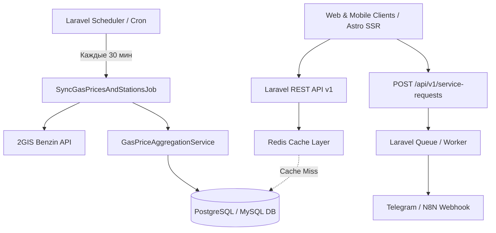

# План реализации Backend на Laravel 11: Мониторинг цен на топливо, АЗС и дорожные сегменты («За Рулём»)

Документ представляет собой исчерпывающее техническое руководство и спецификацию для переноса существующего стека (Directus CMS + N8N воркфлоу) на автономный, производительный backend на **Laravel 11 (PHP 8.3/8.4)**.

---

## 1. Архитектура и ключевые цели

### 1.1. Назначение системы
- **Единый источник истины** для цен на бензин, дизель и газ по всем городам РФ, федеральным трассам и конкретным АЗС (17 000+ станций).
- **Фоновый сбор и агрегация данных (Ingestion Engine)**: опрос 2GIS Benzin API каждые 30 минут, нормализация названий сетей, детерминированные ключи, батчевое сохранение (UPSERT).
- **Высокопроизводительный REST API (v1)**: быстрое чтение с Redis-кешированием для SSG/SSR клиентов (Astro, Next.js, мобильные приложения) и генератора `sitemap.xml`.
- **Интерактивные сервисы**: гео-поиск АЗС в видимой области карты (`bounding box`), мониторинг очередей на заправках (`queue_level`), прием и маршрутизация заявок техпомощи и очередей (n8n Webhook / Telegram).

### 1.2. Архитектурная схема


### 1.3. Структура проекта Laravel
```text
app/
├── Console/
│   └── Commands/
│       └── SyncGasPricesCommand.php         # Artisan-команда php artisan gas:sync-prices
├── Http/
│   ├── Controllers/
│   │   └── Api/
│   │       └── V1/
│   │           ├── CityController.php             # /api/v1/cities
│   │           ├── GasPriceController.php         # /api/v1/gas-prices
│   │           ├── GasPriceSitemapController.php  # /api/v1/gas-prices/sitemap
│   │           ├── GasQueueController.php         # /api/v1/cities/{city}/queues
│   │           ├── RoadSegmentController.php      # /api/v1/road-segments
│   │           ├── ServiceRequestController.php   # /api/v1/service-requests
│   │           └── StationController.php          # /api/v1/stations
│   ├── Requests/
│   │   ├── GetBoundsStationsRequest.php
│   │   └── StoreServiceRequest.php
│   └── Resources/
│       └── V1/
│           ├── CityResource.php
│           ├── GasBrandHistoryResource.php
│           ├── GasPriceSitemapResource.php
│           ├── GasPriceSnapshotResource.php
│           ├── QueueBoardResource.php
│           ├── RoadSegmentResource.php
│           └── StationResource.php
├── Jobs/
│   ├── SendServiceRequestToWebhookJob.php   # Фоновая отправка лида в webhook/Telegram
│   └── SyncGasPricesAndStationsJob.php      # Фоновый сбор и UPSERT цен
├── Models/
│   ├── City.php
│   ├── GasDaily.php
│   ├── RoadSegment.php
│   └── Station.php
└── Services/
    ├── GasPrice/
    │   ├── BrandSlugNormalizer.php          # Каноническая нормализация брендов АЗС
    │   ├── GasPriceAggregationService.php   # Агрегация цен, расчет min/max/avg, окна :00/:30
    │   └── StationSlugGenerator.php         # Генерация уникальных слагов станций
    └── TwoGis/
        └── TwoGisGasStationClient.php       # HTTP-клиент 2GIS API с retry и пагинацией
```

---

## 2. Схема базы данных и миграции Laravel

### 2.1. Таблица `cities` (Справочник городов)
Хранит перечень обслуживаемых городов, грамматические падежи для SEO-генерации текстов и географические границы.

```php
// database/migrations/2026_01_01_000001_create_cities_table.php
Schema::create('cities', function (Blueprint $table) {
    $table->id();
    $table->string('slug', 100)->unique();
    $table->string('name', 150);
    $table->string('case_in', 150);      // в Тюмени
    $table->string('case_of', 150);      // Тюмени (цены Тюмени)
    $table->string('case_by', 150);      // Тюменью
    $table->string('case_for', 150);     // для Тюмени
    $table->string('hint', 255)->nullable();
    $table->string('region', 150)->nullable();
    $table->unsignedInteger('population')->default(0);
    $table->boolean('is_featured')->default(false);
    $table->boolean('is_default')->default(false);
    $table->boolean('is_indexable')->default(true);
    $table->string('seo_title', 255)->nullable();
    $table->text('seo_description')->nullable();
    $table->double('bounds_min_lat');
    $table->double('bounds_max_lat');
    $table->double('bounds_min_lon');
    $table->double('bounds_max_lon');
    $table->integer('sort')->default(0);
    $table->string('status', 30)->default('published');
    $table->timestamps();

    $table->index(['status', 'sort', 'name'], 'idx_cities_status_sort');
    $table->index('is_default', 'idx_cities_default');
});
```

### 2.2. Таблица `stations` (Реестр АЗС)
Хранит гео-точки АЗС, статусы работы, текущие цены и уровни очередей.
- Первичный ключ `id`: строковый идентификатор станции из 2GIS (до 64 символов).
- `slug`: уникальный читаемый латинский слаг вида `lukoil-ul-lenina-55-4a1b2c`.

```php
// database/migrations/2026_01_01_000002_create_stations_table.php
Schema::create('stations', function (Blueprint $table) {
    $table->string('id', 64)->primary(); // 2GIS Station ID
    $table->string('slug', 120)->unique();
    $table->string('name', 255);
    $table->string('brand', 100)->nullable(); // латинский slug бренда (lukoil, gazpromneft)
    $table->string('address', 255)->nullable();
    $table->double('lat')->nullable();
    $table->double('lng')->nullable();
    $table->json('fuel_assortment')->nullable(); // список доступных видов топлива ['ai92', 'ai95', 'dt']
    $table->json('fuel_statuses')->nullable();   // статусы доступности колонок
    $table->json('prices')->nullable();          // оперативные цены вида [{"fuelType":"ai95","price":61.5}]
    $table->timestamp('last_transaction_at')->nullable();
    $table->boolean('closed')->default(false);
    $table->string('queue_level', 50)->nullable(); // low, medium, high, critical
    $table->string('status', 30)->default('published');
    $table->timestamps();

    $table->index('brand', 'idx_stations_brand');
    $table->index(['lat', 'lng'], 'idx_stations_coords');
    $table->index('status', 'idx_stations_status');
});
```

### 2.3. Таблица `gas_daily` (Снимки и история цен)
Унифицированная таблица для трех уровней цен:
1. `area_type = 'city'` — агрегированные городские снимки по сетям АЗС.
2. `area_type = 'road'` — агрегированные снимки цен на участке трассы.
3. `area_type = 'point'` — индивидуальные снимки цен конкретной АЗС (`station_id != null`).

- Первичный ключ `id`: детерминированная строка `{area_type}:{area_slug}:{brand_slug}:{snapshot_date}` (или `point:{station_id}:{snapshot_date}`).

```php
// database/migrations/2026_01_01_000003_create_gas_daily_table.php
Schema::create('gas_daily', function (Blueprint $table) {
    $table->string('id', 255)->primary();
    $table->string('station_id', 64)->nullable();
    $table->string('brand_slug', 100);
    $table->string('area_type', 30)->default('city'); // 'city', 'road', 'point'
    $table->string('area_slug', 100);                 // 'tyumen', 'm-7-petushki-peksha', 'azs-123'
    $table->string('area_parent_slug', 100)->nullable(); // слаг родительского региона/города
    $table->timestamp('snapshot_date');
    $table->json('fuel_prices'); // [{fuelType, average, min, max, sampleCount, updatedAt}]
    $table->unsignedInteger('station_count')->default(1);
    $table->timestamp('source_updated_at')->nullable();
    $table->timestamps();

    $table->foreign('station_id')->references('id')->on('stations')->nullOnDelete();
    $table->index(['area_type', 'area_slug', 'snapshot_date'], 'idx_gas_daily_query');
    $table->index(['brand_slug', 'area_type'], 'idx_gas_daily_brand');
    $table->index(['area_parent_slug', 'area_type'], 'idx_gas_daily_parent');
    $table->index('snapshot_date', 'idx_gas_daily_snapshot');
});
```

### 2.4. Таблица `road_segments` (Сегменты федеральных трасс)
Участки трасс с шагом ~15 км для локального поиска АЗС и расчета цен.

```php
// database/migrations/2026_01_01_000004_create_road_segments_table.php
Schema::create('road_segments', function (Blueprint $table) {
    $table->uuid('id')->primary();
    $table->string('slug', 120)->unique();
    $table->string('name', 255);
    $table->string('route_code', 50); // m-7, r-255, m-4
    $table->string('city_slug', 100)->nullable();
    $table->integer('sort')->default(0);
    $table->string('status', 30)->default('published');
    $table->json('center')->nullable(); // {lat, lng}
    $table->double('start_lat')->nullable();
    $table->double('start_lon')->nullable();
    $table->double('end_lat')->nullable();
    $table->double('end_lon')->nullable();
    $table->double('bounds_min_lat')->nullable();
    $table->double('bounds_max_lat')->nullable();
    $table->double('bounds_min_lon')->nullable();
    $table->double('bounds_max_lon')->nullable();
    $table->integer('corridor_km')->default(5);
    $table->json('geometry')->nullable(); // GeoJSON / Polyline coordinates
    $table->json('stations')->nullable(); // Закэшированный список ID станций
    $table->timestamp('stations_updated_at')->nullable();
    $table->boolean('stations_locked')->default(false);
    $table->string('seo_title', 255)->nullable();
    $table->text('seo_description')->nullable();
    $table->longText('content')->nullable(); // Markdown-описание участка
    $table->timestamps();

    $table->index(['route_code', 'sort'], 'idx_segments_route');
    $table->index('status', 'idx_segments_status');
});
```

---

## 3. Бизнес-логика, алгоритмы и пайплайн сбора данных

### 3.1. Нормализация брендов (`BrandSlugNormalizer`)
Очищает названия станций от мусора (АЗС, АГЗС, кавычки), транслитерирует и сопоставляет с каноническим словарем сетей:

```php
namespace App\Services\GasPrice;

class BrandSlugNormalizer
{
    private const CANONICAL_MAP = [
        'лукойл' => 'lukoil', 'lukoyl' => 'lukoil',
        'теболойл' => 'teboil', 'тебойл' => 'teboil',
        'газойл' => 'gazoil', 'газпромнефть' => 'gazpromneft',
        'газпром нефть' => 'gazpromneft', 'газпром' => 'gazprom',
        'башнефть' => 'bashneft', 'роснефть' => 'rosneft',
        'татнефть' => 'tatneft', 'калина-ойл' => 'kalina-oil',
        'калина ойл' => 'kalina-oil', 'топлайн' => 'topline',
        'флэш' => 'flash', 'флеш' => 'flash', 'flash' => 'flash',
        'ирбис' => 'irbis', 'атан' => 'atan', 'кондор' => 'kondor',
        'сигнал' => 'signal', 'крайснефть' => 'kraisneft',
        'брк' => 'brk', 'опти' => 'opti', 'ека' => 'eka',
        'нефтьмагистраль' => 'neftmagistral', 'сургутнефтегаз' => 'surgutneftegas',
    ];

    public static function normalize(?string $brandOrName): string
    {
        if (empty($brandOrName)) {
            return 'azs';
        }

        $cleaned = mb_strtolower(trim($brandOrName));
        $cleaned = str_replace('ё', 'е', $cleaned);
        $cleaned = preg_replace('/[«»"\'`]/u', '', $cleaned);
        // Удаление суффиксов АЗС/АГЗС/заправка
        $cleaned = preg_replace('/[\s,-]*(?:азс|азк|агзс|агнкс|автозаправочная станция|автозаправочный комплекс|заправочная станция|заправка)$/ui', '', $cleaned);
        $cleaned = trim($cleaned);

        $latin = self::toLatin($cleaned);

        return self::CANONICAL_MAP[$cleaned] 
            ?? self::CANONICAL_MAP[$latin] 
            ?? $latin 
            ?: 'azs';
    }

    public static function toLatin(string $text): string
    {
        $cyr = [
            'а'=>'a','б'=>'b','в'=>'v','г'=>'g','д'=>'d','е'=>'e','ё'=>'e','ж'=>'zh',
            'з'=>'z','и'=>'i','й'=>'y','к'=>'k','л'=>'l','м'=>'m','н'=>'n','о'=>'o',
            'п'=>'p','р'=>'r','с'=>'s','т'=>'t','у'=>'u','ф'=>'f','х'=>'h','ц'=>'c',
            'ч'=>'ch','ш'=>'sh','щ'=>'sch','ъ'=>'','ы'=>'y','ь'=>'','э'=>'e','ю'=>'yu','я'=>'ya'
        ];
        $res = strtr(mb_strtolower($text), $cyr);
        $res = preg_replace('/[^a-z0-9]+/i', '-', $res);
        return trim($res, '-');
    }
}
```

### 3.2. Генератор слагов станций (`StationSlugGenerator`)
Формирует уникальный и человекочитаемый слаг АЗС на основе бренда, транслита адреса и 6 символов ID:
`{brand}-{address-translit}-{last6_id}`.
Пример: `lukoil-moskovskiy-trakt-120-700000`

### 3.3. Сервис агрегации цен (`GasPriceAggregationService`)
1. **Округление даты снимка к получасовым интервалам (`:00` и `:30`)**:
   ```php
   $now = now();
   $minute = $now->minute < 30 ? 0 : 30;
   $snapshotDate = $now->copy()->setMinute($minute)->setSecond(0);
   ```
2. **Фильтрация цен**: отбрасывание цен с датой обновления старше 7 дней (`updatedAt < now - 7 days`).
3. **Расчет метрик**: для каждого типа топлива (`ai92`, `ai95`, `ai98`, `ai100`, `dt`, `lpg`, `cng`) рассчитываются `average`, `min`, `max`, `sampleCount`.
4. **Формирование детерминированного ключа**:
   - City: `city:{city_slug}:{brand_slug}:{snapshot_date_iso}`
   - Road: `road:{segment_slug}:{brand_slug}:{snapshot_date_iso}`
   - Point: `point:{station_id}:{snapshot_date_iso}`

### 3.4. Идемпотентный фоновый сбор (`SyncGasPricesAndStationsJob`)
- Запрашивает активные города и сегменты трасс.
- Выполняет параллельные / батчевые запросы к 2GIS API по географическим рамкам (`bounds`).
- Выполняет раздельный батчевый **UPSERT**:
  1. `Station::upsert($stationsData, ['id'], ['slug', 'name', 'brand', 'address', 'lat', 'lng', 'fuel_assortment', 'fuel_statuses', 'prices', 'closed', 'queue_level', 'status', 'updated_at']);`
  2. `GasDaily::upsert($areaSnapshots, ['id'], ['brand_slug', 'area_type', 'area_slug', 'area_parent_slug', 'snapshot_date', 'fuel_prices', 'station_count', 'source_updated_at', 'updated_at']);`
  3. `GasDaily::upsert($pointSnapshots, ['id'], ['station_id', 'brand_slug', 'area_type', 'area_slug', 'area_parent_slug', 'snapshot_date', 'fuel_prices', 'station_count', 'source_updated_at', 'updated_at']);`
- Инвалидирует связанные теги Redis-кеша (`gas_prices:city:*`, `stations:bounds:*`).
- Расписание в `routes/console.php`:
  ```php
  Schedule::command('gas:sync-prices')->everyThirtyMinutes()->runInBackground();
  ```

---

## 4. Спецификация REST API v1

Все эндпоинты возвращают JSON в стандартной обертке Laravel API Resource.

### 4.1. Справочник городов
- **`GET /api/v1/cities`**
  - **Описание**: Список всех опубликованных городов.
  - **Сортировка**: `is_featured DESC`, `sort ASC`, `name ASC`.
  - **Кеширование**: Redis 60 минут (тег `cities`).
  - **Ответ**:
    ```json
    {
      "data": [
        {
          "id": 1,
          "slug": "tyumen",
          "name": "Тюмень",
          "case_in": "в Тюмени",
          "case_of": "Тюмени",
          "case_by": "Тюменью",
          "case_for": "для Тюмени",
          "region": "Тюменская область",
          "population": 855000,
          "is_featured": true,
          "is_default": true,
          "is_indexable": true,
          "bounds": {
            "min_lat": 57.05,
            "max_lat": 57.25,
            "min_lon": 65.35,
            "max_lon": 65.75
          }
        }
      ]
    }
    ```
- **`GET /api/v1/cities/default`**
  - **Описание**: Получение базового города сайта (`is_default = true`).
- **`GET /api/v1/cities/{slug}`**
  - **Описание**: Детальные данные города по его слагу.

### 4.2. Цены на топливо (`gas_daily`)
- **`GET /api/v1/gas-prices/cities/{citySlug}`**
  - **Описание**: Текущие цены по всем сетям АЗС города (последний получасовой снимок) и сравнение с динамикой предыдущего снимка.
  - **Ответ**:
    ```json
    {
      "data": {
        "city_slug": "tyumen",
        "snapshot_date": "2026-08-15T22:00:00Z",
        "brands": [
          {
            "brand_slug": "lukoil",
            "brand_name": "Лукойл",
            "station_count": 28,
            "fuel_prices": [
              {
                "fuel_type": "ai95",
                "average": 62.40,
                "min": 61.90,
                "max": 62.90,
                "sample_count": 28,
                "diff_from_previous": 0.15
              }
            ]
          }
        ]
      }
    }
    ```
- **`GET /api/v1/gas-prices/cities/{citySlug}/brands/{brandSlug}?page=1&per_page=48`**
  - **Описание**: Постраничная история получасовых снимков конкретного бренда в городе (для построения графиков динамики).
- **`GET /api/v1/gas-prices/brands/{brandSlug}/cities`**
  - **Описание**: Список городов, где представлена сеть АЗС.
- **`GET /api/v1/gas-prices/sitemap`**
  - **Описание**: Легковесный сгруппированный агрегат для мгновенной генерации `sitemap.xml`.
  - **Оптимизация**: Выполняет `SELECT area_type, area_slug, brand_slug, MAX(snapshot_date) as last_updated, COUNT(id) as count FROM gas_daily GROUP BY area_type, area_slug, brand_slug` без тяжелых `fuel_prices`.

### 4.3. АЗС, Гео-поиск и Очереди
- **`GET /api/v1/stations?bounds_min_lat=57.0&bounds_max_lat=57.3&bounds_min_lon=65.3&bounds_max_lon=65.8`**
  - **Описание**: Поиск АЗС в прямоугольной географической рамке (для интерактивной карты 2GIS).
  - **Параметры**: `bounds_min_lat`, `bounds_max_lat`, `bounds_min_lon`, `bounds_max_lon`, опционально `brand`, `fuel_type`.
- **`GET /api/v1/cities/{citySlug}/stations`**
  - **Описание**: Все заправки города, обогащенные последними ценами из point-снимков.
- **`GET /api/v1/stations/{idOrSlug}`**
  - **Описание**: Карточка АЗС по ID 2GIS или уникальному слагу.
- **`GET /api/v1/cities/{citySlug}/queues`**
  - **Описание**: Оперативная доска очередей города: разбивка станций по уровням загрузки (`low`, `medium`, `high`, `critical`) и расчет суточных окон свободного времени.

### 4.4. Дорожные сегменты
- **`GET /api/v1/routes/{routeCode}/segments`**
  - **Описание**: Список 15-километровых участков федеральной трассы (например, `m-7`, `m-4`), отсортированных по `sort`.
- **`GET /api/v1/road-segments/{slug}`**
  - **Описание**: Данные участка, GeoJSON/полилиния, границы поиска и привязанные заправки.
- **`GET /api/v1/road-segments/{slug}/prices`**
  - **Описание**: История и текущий срез цен топлива на участке трассы.

### 4.5. Прием заявок (Лидогенерация)
- **`POST /api/v1/service-requests`**
  - **Описание**: Прием заявок водителей (техпомощь, подвоз топлива, вызов очереди).
  - **Валидация (`StoreServiceRequest`)**:
    ```json
    {
      "phone": "89088712026",
      "email": "driver@example.com",
      "subject": "Подвоз топлива АИ-95",
      "message": "Трасса М-7, 124 км, закончился бензин",
      "project": "gaztochka"
    }
    ```
  - **Поведение**: Валидирует запрос, сохраняет в базу и ставит в очередь `SendServiceRequestToWebhookJob` для асинхронного `POST` на `https://n8n.w1do.ru/webhook/requests`.

---

## 5. Стратегия кеширования и производительность (Redis)

1. **Кеш-тегирование**:
   - `cities` — список городов (инвалидация при редактировании в админке / сидинге).
   - `gas_prices:city:{city_slug}` — снимок цен города (TTL 35 минут, инвалидация джобой сбора).
   - `gas_prices:sitemap` — выгрузка sitemap (TTL 120 минут).
   - `stations:city:{city_slug}` — список станций города (TTL 60 минут).
2. **Индексация БД**:
   - Составные B-Tree индексы на `(area_type, area_slug, snapshot_date)` обеспечивают выборку за < 3 мс даже при миллионах записей в `gas_daily`.
   - Пространственные индексы на `(lat, lng)` в таблице `stations` для мгновенных bounds-запросов.

---

## 6. План внедрения и тестирования

### Этап 1: Архитектура БД и модели Eloquent
1. Создать миграции для `cities`, `stations`, `gas_daily`, `road_segments`.
2. Реализовать Eloquent-модели, casts для JSON-полей, связи и Scopes (`published`, `default`, `withinBounds`).

### Этап 2: Пайплайн сбора 2GIS и Агрегатор цен
1. Реализовать `BrandSlugNormalizer` с тестами на все кириллические/латинские вариации.
2. Создать `TwoGisGasStationClient` с моками для `Http::fake()`.
3. Создать `GasPriceAggregationService` с логикой отсечения старых цен и получасовых бакетов.
4. Создать джобу `SyncGasPricesAndStationsJob` и команду `gas:sync-prices`.

### Этап 3: REST API для городов, цен и sitemap
1. Реализовать контроллеры и API Resources для `CityController`, `GasPriceController`, `GasPriceSitemapController`.
2. Покрыть Feature-тестами контракты JSON и фильтрацию.

### Этап 4: REST API для станций, очередей и трасс
1. Реализовать `StationController` (гео-поиск по рамке bounds), `GasQueueController`, `RoadSegmentController`.
2. Проверить точность выборки станций в гео-коридорах.

### Этап 5: Очереди, Webhook заявок и Redis-кеш
1. Реализовать `ServiceRequestController` и `SendServiceRequestToWebhookJob`.
2. Настроить Redis-тегирование и автоматическую инвалидацию.
3. Провести нагрузочное тестирование API.
